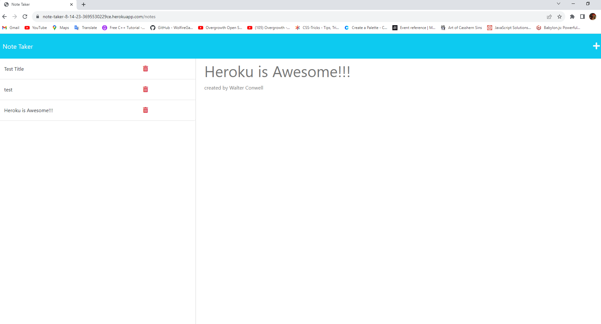

# note taker

express.js

## Description

This is a note taker designed so you can keep track of important notes.
Click the "Note Title" field, to enter a title for your note.
After that, type in anything for the "Note Text" field.
When you're done with your note, click the floppy disk button, and the note will save and be available for future viewing.

## Screenshot:

## Table of Contents

- [Usage](#usage)
- [Contributors](#credits)
- [Questions](#gitUser)

## Usage

Create and save notes with this note-taker.

## Badges

## Contributors

Jacob Carver

## Questions

- github: www.github.com/Walter-Conwell
- email: walterdanteconwelljr@gmail.com
- live deployment link (Heroku): https://note-taker-8-14-23-3695530229ce.herokuapp.com/notes
